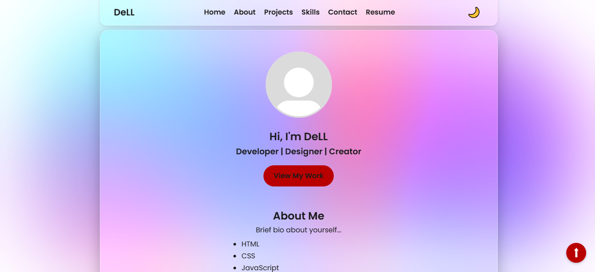

# 🌐 Glass – The Ultimate Portfolio Website


---
**Glass** is a stunning, glassmorphic-themed portfolio website built with HTML, CSS, JavaScript, and Node.js. It features a sleek, modern UI with a responsive layout, customizable sections, dark mode, and smooth animations.



---

## 🚀 Features

- ✅ Responsive design with mobile support
- ✅ Glassmorphism + animated color blobs
- ✅ Dark/light theme toggle
- ✅ Modular sections: Hero, About, Skills, Projects, Experience, Testimonials, Contact
- ✅ Resume download button
- ✅ Dynamic quote loader
- ✅ Smooth scrolling and back-to-top button
- ✅ Node.js + Express backend

---

## 🧰 Tech Stack

- HTML5, CSS3, JavaScript (Vanilla)
- Node.js + Express.js (for serving static files)
- Custom theme toggle
- Google Fonts (Poppins)

---

## 📦 Setup

### 1. Clone the Repository

```bash
git clone https://github.com/yourusername/glass-portfolio.git
cd glass-portfolio
```
### 2. Install Dependencies
```bash
npm install
```
### 3. Run the Server
```bash
node server.js
```
Then open your browser and navigate to:
```bash
http://localhost:3000
```

---
## 🛠️ Customization
Update the following sections inside ```public/index.html``` to personalize:
*Hero Section (#hero)

* About Section (```#about```)

* Projects Section (```#projects```)

* Skills Section (```#skills```)

* Experience Section (```#experience```)

* Testimonials (```#testimonials```)

* Contact form and links

You can replace profile images, skill icons, project previews inside the ```public/assets/``` folder.


